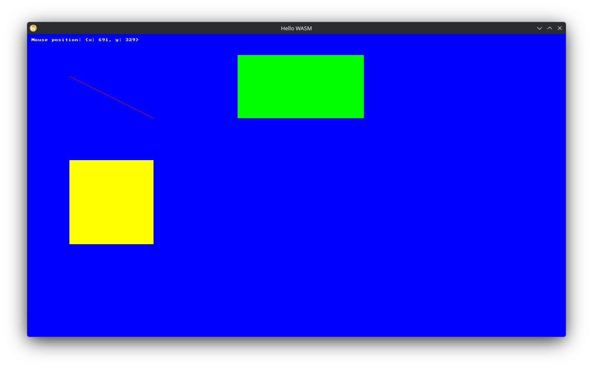
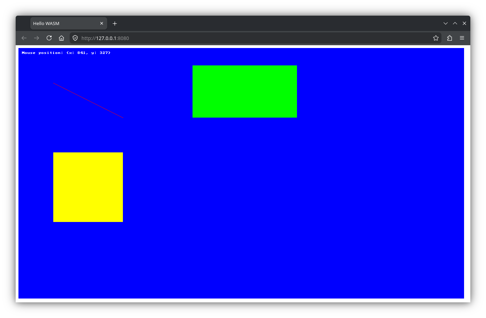

# Go + SDL3 to WASM (Experimental)

This example demonstrates how to compile **Go + SDL3** into WebAssembly (WASM).  
The build process is currently designed for Linux. Windows users may need to adjust specific shell commands.

One of the highlights of this setup is that the example app can be built for both PC and WASM **without changing any application code** — only the build command needs to be adjusted.  
[!WARNING]
This example is highly experimental and serves as a proof of concept. It is intended to be a foundation that can be expanded into a robust WASM build pipeline.  
[!NOTE]
Not all of the SDL functions are available in the WASM build, so some changes may be necessary.  

### Requirements

* **Emscripten**: To build SDL3 to WASM, you need [Emscripten](https://emscripten.org/docs/getting_started/downloads.html) installed. Follow their getting started guide.  
* **Local HTTP Server**: WASM applications cannot be run by simply opening `index.html`. You need a server to host the files. This example uses the `python` built-in HTTP server, but any server will work. To follow the example as is, you need `python` installed.  
  [!Tip]
  The HTTP server could be improved with hot-reloading by monitoring changes in .go files and automatically triggering the build script.

### How to run the example

* **WASM**: To run the example on WASM execute `build.sh`. It will compile everything and host the app on http://localhost:8080/
* **PC**: To run the example on PC execute `go run main.go` in the project example.

### How does it work? (`build.sh` explained)

1. **SDL3 Library**: The SDL3 library is compiled to `sdl.wasm` via Emscripten.
2. **Go App**: The Go app is compiled to `go.wasm` using the standard Go build command.
3. **Hosting**: Both files are hosted on a local HTTP server. To allow communication between `go.wasm` and `sdl.wasm`, a small JavaScript bridge (`sdl.js`) is used.
4. **Go Runtime**: The `wasm_exec.js` file is required to instruct the browser on how to execute `go.wasm`. This file is copied from your Go installation.  
  *Note: The path to this file differs between Go versions 1.23 or older and Go 1.24+ (the build script uses "new" path).*
5. **Communication Flow**: `go.wasm <-> sdl.js <-> sdl.wasm`  
  **Why the bridge?** WASM modules are isolated and cannot communicate directly. While the JavaScript bridge introduces a performance penalty, it is necessary in this build process. To eliminate the bridge, you would need to compile the Go app and SDL3 into a single .wasm file. This is currently not supported by the standard Go compiler, and I didn't have any luck when trying to compile it with TinyGo.  

### Screenshots

PC:  

Browser (WASM):  

