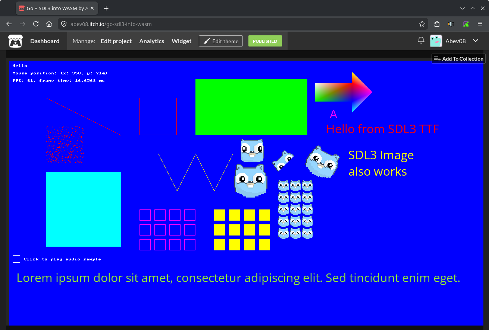

This example demonstrates how to compile **Go + SDL3** into WebAssembly (WASM).\
The build process is currently designed for Linux. Windows users may need to adjust specific shell commands.\
It's recommended to run SDL3 apps in WASM using callback system - for that check "wasm-callbacks" example.

> [!NOTE]
> Not all of the SDL functions are available for the WASM build - some functions are not supported.  

### Requirements
- **Emscripten**: To build SDL3 to WASM, you need [Emscripten](https://emscripten.org/docs/getting_started/downloads.html) installed. Follow their getting started guide.  
- **Local HTTP Server**: WASM applications cannot be run by simply opening `index.html`. You need a server to host the files. This example uses the Python built-in HTTP server, but any server, or HTTP hosting service should work. To follow the example as is, you need **Python** installed.  

> [!Tip]
> The HTTP server could be improved with hot-reloading by monitoring changes in .go files and automatically triggering the build script.

### How to run the example
- **PC**: To run the example on PC execute `go run main.go` in the example directory.
- **WASM**: The build script was created to simplify the build process for WASM. It will compile everything and host the app on http://localhost:8080/. The script has two paths (selected by the if statement):
  - using Emscripten SDL3 build in support. This path is currently **disabled** because Emscripten doesn't support SDL3_image yet and the example showcases SDL3, SDL3_image and SDL3_ttf packages. If your application uses only SDL3 and SDL3_image you can use this path.
  - using SDL3 WASM files compiled from the source code. This path is currently **enabled**. To easily compile SDL3 + SDL3_image + SDL3_ttf into WASM `build_sdl.sh` script was created (it also uses Emscripten). This approach requires more work but has the advantage that you get most up to date versions (or the ones that you want).

### The application is separated into multiple parts (WASM only)
- `sdl.wasm` and `sdl.js` - The result of compiling SDL3 into WASM via Emscripten
- `go.wasm` - The result of compiling Go application into WASM
- `wasm_exec.js` - JavaScript support file required to run Go programs compiled to WebAssembly in the browser. This file is copied from your Go installation.\
  *Note: The path to this file differs between Go versions 1.23 or older and Go 1.24+ (the build script uses "new" path).*
- `index.html` - Entry point of the application. It's custom for Go + SDL3 usage. Created JavaScript files are loaded and communication (bridge) is created between Go and SDL3 parts. Some SDL3 functions require special handling it's important to keep that part unchanged.\
  *Note: You may want to modify the index.html file to achieve the look and feel you require.*

All of the compiled files are placed into `/build/` directory, ready to be compressed and distributed. All of the parts are required to successfully run the application.

### Screenshots
PC:  

Browser (WASM):  

[itch.io](https://abev08.itch.io/go-sdl3-into-wasm):  

